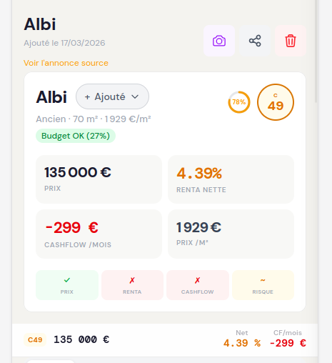

# Page Properties 
## header

### UI
- tx de complétion > faire une barre discrète
- scoring > même composant que le scoring de la home
- information : budget OK > à supprimer
- carré de couleur suivant : prix, renta, cashflow, risque, à supprimer
- sticky header à supprimer, c'est l'encart principal qui doit ce transformer en ce header au scroll mais il ne doit pas être visible sans scroll

## scrapping
à noter : le scrapping va remplir des données dans tous les onglets de la propriété, pas seulement l'onglet bien

## onglet Bien
### partie consultation
- retirer complètement les équipements de l'onglet bien > seulement dans l'onglet equipement
- MAP > recalculer la map à chaque fois qu'on enregistre le bien si on a changé la localisation
- on supprime l'onglet données socio-économique
- on supprime l'onglet données du marchés
### partie modification
- retirer dpe > seulement dans la partie travaux
- retirer equipement > seulement dans équipements
- remonter toutes la partie location classique dans Informations du bien
- partie loyer : 
  - par défaut loyer moyen calculé en auto > via le prix au metre carré de la région et l'onglet équipement
  - si l'utilisateur rempli la case manuellement (ou via scrapping) c'est un loyer entré manuellement > présenté dans la fiche ou renseigné par l'agent immobilier, l'équipement ne modifie plus cette valeur ni donc celle de la simulation par défaut
- retirer le recap de la partie location classique avec rendement brut, net... > ce sera uniquement dans simulation

## onglet travaux
- le budget travaux calculé doit remplir la case travaux de la simulation par défaut immédiatemetn et doit être pris en compte à chaque changement

## onglet equipement 
- idem que onglet travaux, ça doit être prix en compte de l'onglet de simulation par défaut immédiatement et à chaque changement. 
- idem dans l'onglet bien, le loyer calculé automatiqument est modifié, il ne l'est pas si entré manuellement

## onglet simulation 
### Simulation système
- doit avoir exactement la même présentation avec les mêmes données que la simulation qu'on crée nous même mais on peut pas éditer tout simplement (grisé)
- les données de simulations viennent exclusivement des données de l'onglet bien, equipement, travaux. Si on modifie un de ces onglets ça modifie directement immédiatement la simulation

### les recap
- il y a trop de recap, ya l'onglet detail des résultat, bilan de l'opération, le récap en dessous du titre, le recap dans le slider de sélection des simulation, le recapt dans le header de la page
c'est beaucoup trop, comment réduire la surcharge cognitive ??
- les recaps ne sont pas synchro quand il y a une modification

## onglet score
- il doit avoir le même traitement que le score sur la home > carré, même couleur, applat etc... 
- on le supprime > on le rend accessible en cliquant sur l'icone du score dans le header

## nouvel onglet : localité
- on met la localité utilisé pour ce bien > on récupère exactement la même page correspondante du guide de la même localité utilisé (avec fallback). 
ex: si ville albi > j'utilise albi, si ville carcassonne > pas encore la locaité alors j'utilise france
- on retire le call to action de la page guide, le titre investire à... 
- on ajoute la comparaison du bien actuelle avec la localité (votre prix, ecart marché)

# nav bottom
- on retire l'onglet photo